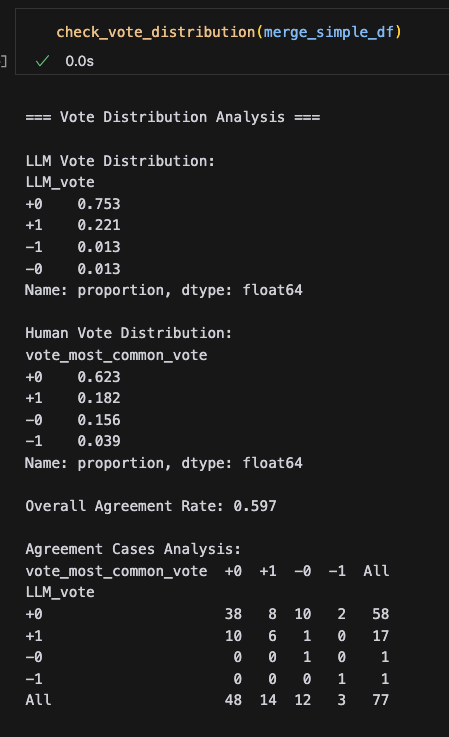
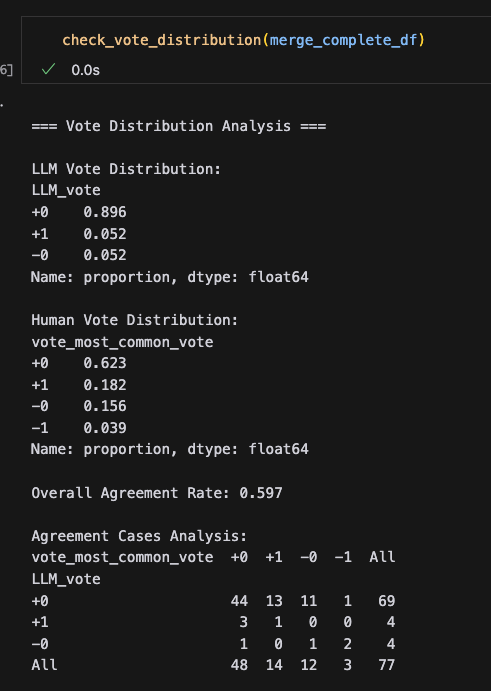

# PyCon TW 2025 Proposal Review Assistant

This project aims to develop an LLM-powered system to assist in the review process of PyCon Taiwan 2025 conference proposals. The system helps filter out potentially problematic proposals and provides automated review assistance to human reviewers.

## Project Goals
1. Filter out potentially problematic proposals through automated analysis
2. Assist human reviewers by providing AI-generated preliminary reviews
3. Validate the effectiveness of LLM-based review assistance

## Setup

### Prerequisites
- Python 3.11+
- Access to Google's Gemini API

### Required Packages
```
langchain
langchain-google-genai
pandas
numpy
jupyter
python-dotenv
openpyxl  # for Excel file handling
pydantic  # for data validation and parsing
```

Note: Specific version requirements are being documented and will be updated soon.

### Environment Setup
1. Clone this repository
2. Create a `.env` file with your API keys:
   ```
   GOOGLE_API_KEY=your_api_key_here
   ```

3. Install dependencies: (TODO: update the requirements.txt)
   ```
   pip install -r requirements.txt
   ```


## Project Structure (wrong, should be updated)
```
.
├── data/                   # Data files
│   ├── pycon_2025_raw_vote.xlsx
│   ├── merged_df_0208.xlsx
│   └── final_df_0127.xlsx
├── prompt/                 # LLM prompt templates
│   ├── full_prompt.txt
│   └── simple_prompt_david.txt
├── exp/                    # Experimental notebooks
│   └── jsonparser_error_control.ipynb
├── notebooks/             # Analysis notebooks
│   ├── llm_review.ipynb
│   ├── llm_review_v2.ipynb
│   └── merge_llm_and_revies.ipynb
└── README.md
```

## Current Status (2025-02-17)

### Vote Distribution Analysis
1. Human Review Distribution:
   - +0 (Neutral): 48 (62.3%)
   - +1 (Positive): 14 (18.2%)
   - -0 (Slightly Negative): 12 (15.6%)
   - -1 (Negative): 3 (3.9%)

2. Simple Prompt LLM Distribution:
   - +0: 58 (75.3%)
   - +1: 17 (22.1%)
   - -1: 1 (1.3%)
   - -0: 1 (1.3%)

3. Complete Prompt LLM Distribution: (TODO: update the result)
   - +0: 69 (89.6%)
   - +1: 4 (5.2%)
   - -0: 4 (5.2%)

### Key Findings
1. Conservative Tendency:
   - All evaluation methods tend to give neutral ratings (+0)
   - Complete Prompt shows extremely conservative behavior (89.6% +0)
   - Human reviews show more balanced distribution

2. Model Performance:
   - Overall agreement rate with human reviewers: 0.294
   - Confusion matrices for different prompts:
     1. Simple prompt result:
        
     2. Complete prompt result:
        

## Current Challenges
1. Model Behavior:
   - Complete prompt shows overly conservative behavior
   - Need for better weighting system between different vote categories (-0 vs +0)
   - Unclear selection criteria for proposal acceptance

2. Validation:
   - Need final proposal acceptance/rejection data for proper validation
   - Uncertainty about handling proposals with -1 votes

## Future Improvements
1. Technical Enhancements:
   - Add summary column for each proposal
   - Create weighted scoring system

2. Model Improvements:
   - Implement LLM-as-judge to evaluate results
   - Improve prompt engineering to reduce conservative bias
   - Develop clear selection criteria

3. Process Improvements:
   - Validate against final acceptance/rejection results
   - Establish clear guidelines for handling negative votes

## Contributing
Feel free to contribute to this project by:
1. Opening issues for bugs or feature requests
2. Submitting pull requests
3. Improving documentation
4. Sharing insights about the review process

## References
1. [Gemini API Documentation](https://ai.google.dev/gemini-api/docs/models/experimental-models?hl=zh-tw)
