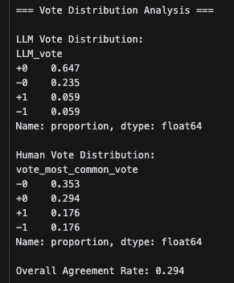
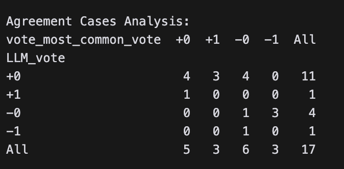

# Goal
(Does this should be project rules in cursor?)
1. first goal is filter out bad proposal
2. second goal is assistant reviewer to review proposal

# TODO
1. one json parse fail due to " ", happened at least 20+ times in 70, maybe should string transfer before json parse

# Result
1. analysis proposals with -1 vote
    -overall agreement rate is 0.294
    
    - confusion matrix
    

# TODO
1. weight should be different in -0 and +0
2. What is the selection criteria? how many +1 vote or without -1 vote?
3. once have -1 vote, didn't get mean the proposal is bad?
4. need to get final propsal accepted or rejected would be more accurate

# Reference
1. gemini model: https://ai.google.dev/gemini-api/docs/models/experimental-models?hl=zh-tw
